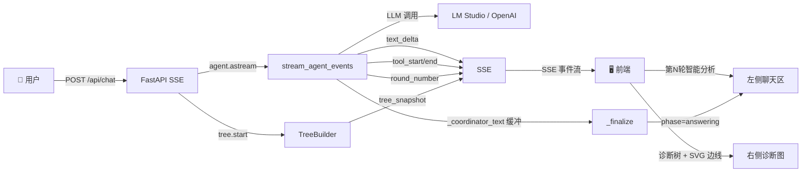
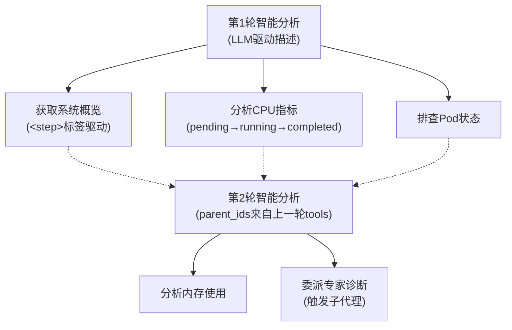
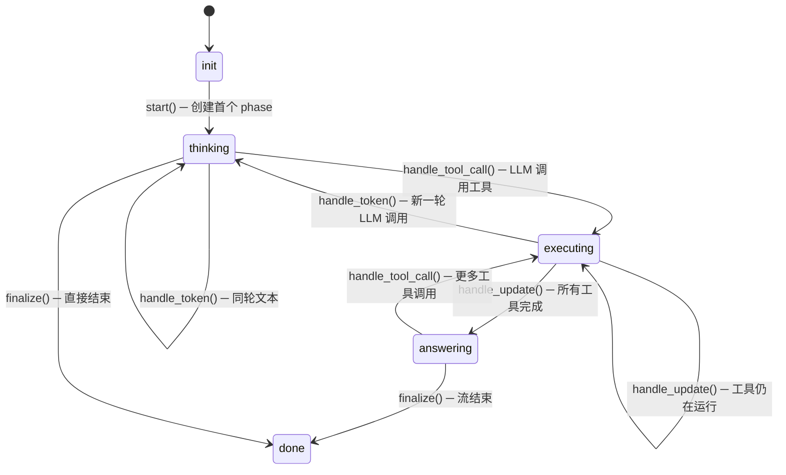
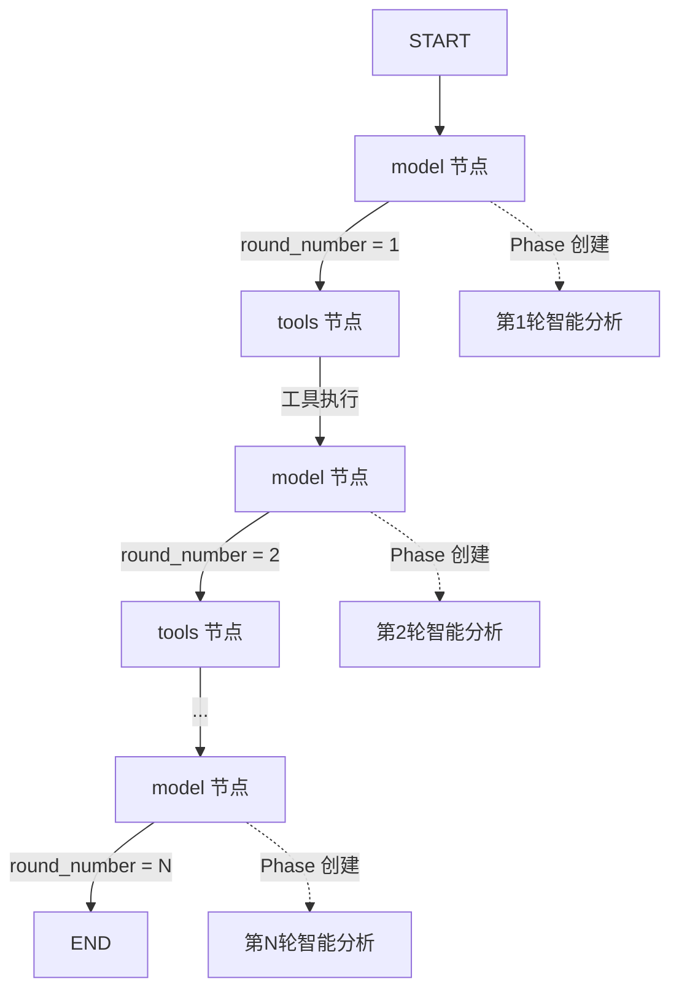
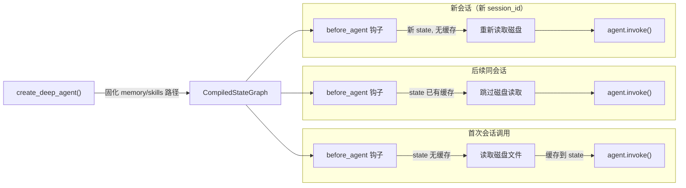

# Diagnostics — AI 驱动的系统故障诊断代理

一个结合大语言模型（LLM）与领域工具，自动执行 Linux / Kubernetes / GPU 故障排查的智能诊断平台。Coordinator 初筛 + 8 个领域 Expert 深度分析，强制 5 轮内完成。前端双栏布局：左侧多轮折叠块 + Markdown 报告，右侧诊断树实时生长。


## 目录

- [架构概览](#架构概览)
- [快速开始](#快速开始)
- [动态诊断图：原理与实现](#动态诊断图原理与实现)
  - [设计哲学](#设计哲学)
  - [核心数据结构](#核心数据结构)
  - [生命周期与状态机](#生命周期与状态机)
  - [Phase（轮次）创建策略](#phase轮次创建策略)
  - [节点描述：完全由 LLM 驱动](#节点描述完全由-llm-驱动)
- [数据流路径](#数据流路径)
  - [端到端时序](#端到端时序)
  - [事件类型一览](#事件类型一览)
- [后端关键实现](#后端关键实现)
  - [事件流处理（streaming.py）](#事件流处理)
  - [诊断树构建器（step_tracker.py）](#诊断树构建器)
  - [SSE 端点（app.py）](#sse-端点)
  - [Agent 工厂（factory.py）](#agent-工厂)
- [前端关键实现](#前端关键实现)
  - [诊断树可视化](#诊断树可视化)
  - [思考过程折叠面板](#思考过程折叠面板)
  - [工具详情弹窗](#工具详情弹窗)
- [项目结构](#项目结构)
- [配置](#配置)

## 架构概览



**数据流分两路**：`text_delta(phase=thinking)` → 前端 "第N轮智能分析" 折叠块；流结束时 `_finalize` 将缓冲文本 → `phase=answering` → 回答区。

技术栈：

| 层 | 技术 |
|---|---|
| Agent 框架 | `deepagents` — 支持子代理委派、文件系统后端、技能加载 |
| LLM 接入 | `langchain-openai` — 兼容 OpenAI API 的本地/远程模型 |
| Web 框架 | `FastAPI` — SSE 流式响应 |
| 前端 | 原生 HTML + CSS + JavaScript，零构建工具 |
| 可视化 | SVG 边线 + 自定义 BFS 层级布局 |
| 运行环境 | `uvicorn` ASGI 服务器 |

## 快速开始

```bash
# 安装依赖
pip install -e .

# 配置环境变量
cp .env.example .env
# 编辑 .env，设置 DIAGNOSTICS_BASE_URL 指向你的 LLM 服务（如 LM Studio）

# 启动服务
python main.py
# 访问 http://127.0.0.1:8000
```

## 动态诊断图：原理与实现

本项目最核心的特性是**右侧面板中随诊断过程实时生长的执行树**。它不是静态图示，而是一个与 Agent ↔ LLM 交互周期同步更新的动态数据结构。

### 设计哲学

诊断树完全由 **LLM 的实时输出驱动**，而非后端硬编码的步骤模板。核心理念：

- **不预设诊断路径**：Agent 根据工具返回的数据，自主决策下一步检查什么
- **LLM 提供语义描述**：每个节点的标题和描述来自 LLM 的思考文本，而非固定字符串
- **树结构反映实际推理**：父子关系代表了 Agent 的真实决策链

### 核心数据结构

诊断树由三种节点类型构成：

```python
class NodeType(Enum):
    ROOT  = "root"    # 根节点："开始诊断"
    PHASE = "phase"   # 轮次节点："第N轮智能分析"
    TOOL  = "tool"    # 工具节点："分析CPU指标"、"排查Pod状态"等
```

树的结构层次：



每个节点携带的字段：

| 字段 | 说明 |
|---|---|
| `id` | 唯一标识（如 `n1`, `n2`） |
| `title` | 中文显示名称（工具名→中文映射表） |
| `parent_id` / `parent_ids` | 父节点引用（PHASE 节点支持多父） |
| `status` | `pending` / `running` / `completed` / `error` |
| `description` | 由 LLM 输出驱动，描述此步骤的目的 |
| `tool_name` / `tool_args` | 工具函数名和参数，前端展示为 `check_cpu(profile="default")` |

### 生命周期与状态机

`TreeBuilder` 内部维护一个有限状态机，每个转换对应一次外部事件驱动：



### Phase（轮次）创建策略

整个诊断由多个**轮次（Round）**组成，每轮对应一次 LangGraph **model 节点进入**。`streaming.py` 通过 `metadata["langgraph_node"]` 检测节点转换，递增 `round_number`。



**Phase 创建时机**：`handle_token(text, round_num)` 中 round 变化时创建新 phase。随后工具调用作为子节点加入当前 phase。下一轮的所有 tool 节点通过 `_last_tool_child_ids` 成为下一 phase 的 `parent_ids`，在 BFS 层级布局中形成链式连接。

**关键：parent_ids 继承**

```python
def _create_next_phase(self) -> str:
    # 新 phase 的 parent_ids 指向上一轮的所有 tool 子节点
    parent_ids = list(dict.fromkeys(self._last_tool_child_ids)) or [self._current_phase_id]
    ...
    phase = TreeNode(nid, title, parent_ids[0],
                     parent_ids=parent_ids, ...)
```

这意味着在BFS层级布局中，第N轮的 phase 节点会和第N-1轮的所有 tool 节点产生父子连线，形成清晰的因果链可视化。

### 节点描述：完全由 LLM 驱动

这是本项目区别于硬编码流程图方案的核心设计。节点描述（`description` 字段）的来源优先级：

1. **`<step>` 标签**（最高优先级）：LLM 在思考过程中使用 `<step>检查 CPU 使用率和负载均衡</step>` 声明即将执行的操作。`streaming.py` 的 `_parse_step_tags()` 在所有文本处理**之前**提取这些描述，存入 `_pending_step_descriptions` 队列。

2. **思考文本提取**（次优先级）：当 `<step>` 标签不足时，`_build_tool_descriptions()` 从 LLM 的累积思考文本中按语义模式提取：
   - 多工具场景：搜索包含"检查/执行/查看/采集/读取/排查"等动作关键词的句子
   - 单工具场景：取最后一句话

3. **工具参数回退**（兜底）：如果 LLM 未提供任何描述，用工具名称和参数生成（如 `check_cpu(profile="default")`）。

```python
# streaming.py: _process_chunk 中的处理顺序
text = _extract_text(message)

# ① 首先从原始文本解析 <step> 标签
clean_text = _parse_step_tags(text, state)

# ② 然后解析 <think> 标签，区分思考/回答
think_text, answer_text = _parse_think_tags(clean_text, state)

# ③ 当 LLM 发出 tool_call 时，消费 pending_step_descriptions
step_descs = _build_tool_descriptions(state, tool_count)
```

## 数据流路径

### 端到端时序

以下是一次完整诊断请求中各组件的交互时序：

```
┌──────────┐    ┌───────────┐    ┌──────────────────┐    ┌──────────────┐    ┌─────┐
│  Browser │    │  FastAPI  │    │  stream_agent_    │    │  TreeBuilder │    │ LLM │
│ (app.js) │    │  (app.py) │    │  events()         │    │              │    │     │
└────┬─────┘    └─────┬─────┘    └────────┬─────────┘    └──────┬───────┘    └──┬──┘
     │                │                   │                     │               │
     │ POST /api/chat │                   │                     │               │
     │───────────────>│                   │                     │               │
     │                │ tree.start()      │                     │               │
     │                │──────────────────>│                     │               │
     │  SSE session   │                   │ tree_snapshot(root) │               │
     │<───────────────│                   │<────────────────────│               │
     │                │                   │                     │               │
     │                │ agent.astream()   │                     │               │
     │                │──────────────────>│                     │               │
     │                │                   │ ── LLM chunk ──>    │               │
     │                │                   │                     │  "系统CPU使用  │
     │                │                   │                     │   率偏高..."  │
     │                │                   │ <── text delta ──   │               │
     │                │                   │                     │               │
     │                │                   │ handle_token(text)  │               │
     │                │                   │────────────────────>│               │
     │ SSE text_delta │                   │                     │               │
     │<───────────────│                   │                     │               │
     │                │                   │                     │               │
     │                │                   │ ── AIMessage ──>    │               │
     │                │                   │   tool_calls=[...]  │               │
     │                │                   │ <── tool_calls ──   │               │
     │                │                   │                     │               │
     │                │                   │ parse <step> tags   │               │
     │                │                   │ build descriptions  │               │
     │                │                   │                     │               │
     │                │                   │ AgentEvent(         │               │
     │                │                   │   "tool_start",     │               │
     │                │                   │   description=...)  │               │
     │                │                   │                     │               │
     │                │                   │ handle_tool_call()  │               │
     │                │                   │────────────────────>│               │
     │                │                   │                     │ create phase  │
     │                │                   │                     │ + tool nodes  │
     │                │                   │ tree_snapshot       │               │
     │                │                   │<────────────────────│               │
     │                │                   │                     │               │
     │ SSE tree_      │                   │                     │               │
     │ snapshot +      │                   │                     │               │
     │ tool_start      │                   │                     │               │
     │<───────────────│                   │                     │               │
     │                │                   │                     │               │
     │ ── frontend renders tree ──>       │                     │               │
     │                │                   │                     │               │
     │                │                   │ ── Tool executes ─> │               │
     │                │                   │ <── ToolMessage ──  │               │
     │                │                   │                     │               │
     │                │                   │ AgentEvent(         │               │
     │                │                   │   "tool_end", ...)  │               │
     │                │                   │                     │               │
     │                │                   │ handle_update()     │               │
     │                │                   │────────────────────>│               │
     │                │                   │                     │ all done →    │
     │                │                   │                     │ next phase    │
     │                │                   │ tree_snapshot       │               │
     │                │                   │<────────────────────│               │
     │                │                   │                     │               │
     │ SSE tool_end +  │                   │                     │               │
     │ tree_snapshot   │                   │                     │               │
     │<───────────────│                   │                     │               │
     │                │                   │                     │               │
     │     ... 多轮交互循环重复 ...        │                     │               │
     │                │                   │                     │               │
     │                │                   │ _finalize()         │               │
     │                │                   │ tree.finalize()     │               │
     │                │                   │────────────────────>│               │
     │                │                   │                     │ mark done     │
     │                │                   │ tree_snapshot       │               │
     │                │                   │<────────────────────│               │
     │                │                   │                     │               │
     │ SSE done +      │                   │                     │               │
     │ tree_snapshot   │                   │                     │               │
     │<───────────────│                   │                     │               │
     │                │                   │                     │               │
     │ ── finalizeGraph() ──>            │                     │               │
```

### 事件类型一览

| SSE 事件 | 触发时机 | 前端行为 |
|---|---|---|
| `session` | 连接建立 | 保存 session_id |
| `text_delta` | LLM 输出文本 / 工具结果 | phase=thinking → 追加到 "第N轮智能分析" 折叠块（含 🔧📊）；phase=answering → 追加到诊断报告区（仅流结束时最终报告） |
| `tool_start` | LLM 发出工具调用 | （信息性，树由 tree_snapshot 驱动） |
| `tool_end` | 工具执行完毕 | （信息性，树由 tree_snapshot 驱动） |
| `tree_snapshot` | 树结构发生变化 | **完全重建诊断树**：重新计算 BFS 层级、渲染节点、绘制 SVG 边线 |
| `tool_args_available` | 流式参数到达（updates模式） | 更新 tool 节点的参数显示 |
| `agent_start` / `agent_end` | 子代理启动/结束 | （信息性） |
| `done` / `cancelled` / `error` | 流终止 | 折叠思考面板、标记完成状态 |

## 后端关键实现

### 事件流处理（`diagnostics/agent/streaming.py`）

核心函数 `stream_agent_events()` 负责将 `deepagents` 的原始流式输出转换为结构化的 `AgentEvent` 序列。

**并发模型**：

```python
async def stream_agent_events(agent, messages, cancel_event, session_id):
    chunk_queue = asyncio.Queue()  # 解耦生产和消费

    # 生产者: 将 agent.astream() 的原始数据放入队列
    async def _producer():
        async for raw in agent.astream(...):
            await chunk_queue.put(raw)

    # 消费者: 从队列取数据，用 asyncio.wait 同时监听取消信号
    while True:
        get_task = asyncio.ensure_future(chunk_queue.get())
        cancel_task = asyncio.ensure_future(cancel_event.wait())
        done, pending = await asyncio.wait(
            {get_task, cancel_task},
            return_when=asyncio.FIRST_COMPLETED,
        )
        if cancel_task in done:
            yield AgentEvent("cancelled", ...)
            return
        raw = await get_task
        for evt in _process_chunk(raw, state, session_id):
            yield evt
```

**LangGraph 节点检测与轮次管理**：

`_process_chunk()` 从 `stream_mode="messages"` 的 metadata 中提取 `langgraph_node` 字段，检测 coordinator 是否进入 `"model"` 节点。每次 model 节点转换代表一次新的 LLM 调用，`round_number` 在文本处理之前递增，确保所有 `text_delta` 事件携带正确的轮次号。

```python
node_type = metadata.get("langgraph_node", "")
if is_coordinator and node_type == "model":
    if state._last_node_type != "model":
        state.round_number += 1  # 新 LLM 调用 → 新轮次
```

**标签解析与文本路由**：

1. **`_parse_step_tags()`** — 最先执行，提取 `<step>` 标签声明。当 LLM 纯输出 `<step>` 标签（无其他文本）时，将步骤文本也发送到前端，用 `new_steps_added` 标志避免流式传输中每个中间 chunk 重复发送。

2. **`_parse_think_tags()`** — 解析 `<think>...</think>` 块，区分深度思考内容和最终回答。

3. **文本路由** — 主代理（coordinator）的中间推理文本仅发送到 `phase="thinking"`（创建折叠块），并累积到 `_coordinator_text` 缓冲区。流结束时 `_finalize()` 将缓冲区内容发送到 `phase="answering"`（回答区正文）。工具调用痕迹（🔧）和工具返回结果（📊）同样路由到 `phase="thinking"`，归入当前轮次折叠块。子代理文本按名称路由：`report-writer` → `answering`，其他 → `thinking`。

**子代理的阶段路由规则**：

```python
def _subagent_phase(path, state) -> str:
    # report-writer 的所有输出 → answering（显示为诊断报告）
    # 其他子代理的输出 → thinking（显示为可折叠的推理过程）
    name = state._task_call_id_to_name.get(call_id, "")
    return "answering" if name == "report-writer" else "thinking"
```

**双通道参数提取**：部分 LLM 后端（如 LM Studio/Qwen）在流式模式下，`messages` 模式的 tool_call 中参数为空，完整参数出现在 `updates` 模式。`_process_chunk()` 同时处理两种模式：

```python
if mode == "messages":
    # 主通道：可能收到空的 tool_call args
    ...
elif mode == "updates":
    # 补全通道：从 LangGraph state 中提取完整参数
    for msg in value["messages"]:
        tcs = getattr(msg, "tool_calls", None)
        if tcs:
            for tc in tcs:
                # 如果 active_tools 中已有记录但 args 为空，补全
                if info and not info.get("args"):
                    info["args"] = tc_args
                    events.append(AgentEvent("tool_args_available", ...))
```

### 诊断树构建器（`diagnostics/server/step_tracker.py`）

`TreeBuilder` 是一个**被动响应式**构建器，它在接收到事件时同步更新内部树状态。

```python
@dataclass
class TreeBuilder:
    nodes: dict[str, TreeNode]           # id → TreeNode
    node_order: list[str]                # 保持插入顺序
    state: str = "init"                  # 状态机
    _current_phase_id: str               # 当前活跃 phase
    _last_tool_child_ids: list[str]      # 上一轮创建的 tool 节点 ID
    think_buffer / think_segments        # LLM 思考文本累积
    answer_buffer                        # LLM 回答文本累积
```

**快照生成**：每次树状态变更时，调用 `_snapshot_event()` 生成完整的节点列表快照：

```python
def _snapshot_event(self) -> dict[str, Any]:
    return {
        "type": "tree_snapshot",
        "steps": [
            {
                "id": node.id,
                "title": node.title,
                "parent_id": node.parent_id,
                "parent_ids": node.parent_ids,
                "status": node.status.value,     # "pending"|"running"|"completed"|"error"
                "node_type": node.node_type.value, # "root"|"phase"|"tool"
                "description": node.description,   # LLM 驱动的描述
                "tool_name": node.tool_name,
                "tool_args": node.tool_args,
            }
            for nid in self.node_order
        ],
    }
```

前端接收到 `tree_snapshot` 事件时，**完全重建**可视化树，而非增量更新。这种设计简化了前后端同步，避免增量 diff 的复杂性。

### SSE 端点（`diagnostics/server/app.py`）

`_chat_event_stream()` 是 SSE 事件的生产者。它协调三个关键组件：

```python
async def _chat_event_stream(request, session_id, state, agent, settings):
    tree = TreeBuilder()

    # 1. 发送 session_id
    yield sse("session", {"session_id": session_id})

    # 2. 初始化树（创建 root 节点）
    for snap in tree.start():
        yield sse("tree_snapshot", snap)

    # 3. 主循环：消费 Agent 事件，同时驱动 TreeBuilder
    async for event in stream_agent_events(...):
        if event.name == "text_delta":
            yield sse("text_delta", event.payload)
            # 将文本 token 也送入 TreeBuilder
            for tok_evt in tree.handle_token(event.payload["text"]):
                ...

        elif event.name == "tool_start":
            # 将工具调用送入 TreeBuilder（带 LLM 描述）
            tool_calls = [{
                "id": event.payload["id"],
                "name": event.payload["name"],
                "args": event.payload.get("args", {}),
                "description": event.payload.get("description", ""),
            }]
            for snap in tree.handle_tool_call(tool_calls):
                yield sse("tree_snapshot", snap)

        elif event.name == "tool_end":
            # 标记工具完成 → 可能触发新 phase 创建
            for snap in tree.handle_update(...):
                yield sse("tree_snapshot", snap)

    # 4. 最终化：关闭树，发送最终快照
    for snap in tree.finalize():
        yield sse("tree_snapshot", snap)

    yield sse("done", {"session_id": session_id})
```

### Agent 工厂（`diagnostics/agent/factory.py`）

使用 `deepagents` 的 `create_deep_agent()` 构建主 Agent，配置：

- **8 个子代理**：
  - 系统层：`cpu-expert`, `memory-expert`, `disk-io-expert`, `network-expert`, `gpu-expert`
  - K8s 组件层（按 Kubernetes 官方排障模型拆分）：
    - `k8s-control-plane-expert` — API Server、etcd、scheduler、controller-manager
    - `k8s-workload-expert` — Pod 生命周期、OOMKilled、资源限制
    - `k8s-node-expert` — 节点状态、kubelet、压力驱逐
  - 诊断报告由 Coordinator 亲自撰写，不再委派独立的 report-writer
- **双层存储后端**：`CompositeBackend` — `/agent_data/` 路径路由到 `FilesystemBackend`（虚拟文件系统），其他使用 `StateBackend`（内存状态）
- **记忆加载**：`AGENTS.md`/`LEARNINGS.md` 在首次会话调用时从磁盘加载并缓存于 state，新会话自动重新读取（无需重启服务）



## 前端关键实现

### 诊断树可视化（`static/app.js`）

前端诊断树是一个**自上而下的分层树状图**，核心渲染流程：

**1. BFS 层级计算**：

```javascript
function buildLevels() {
    // 从 root 节点开始 BFS
    const roots = [];  // nodeType === "root" 或 parentId 为空的节点
    const levels = [[...roots]];

    // BFS 遍历，按 parent_ids 关系构建层级
    while (queue.length > 0) {
        const nextLevel = [];
        for (const parentId of currentLevel) {
            for (const id of GRAPH.nodeOrder) {
                if (node.parentIds.includes(parentId)) {
                    nextLevel.push(id);
                }
            }
        }
        levels.push(uniqueNext);
    }
    return levels;
}
```

**2. DOM 渲染**：每个层级渲染为一个 `.tree-level` 弹性容器，层间用 `.tree-connector` 分隔。节点根据类型（root/phase/tool）应用不同的 CSS 类和图标：

```javascript
function createNodeDOM(node) {
    if (node.nodeType === "root") {
        // ◈ 图标 + 标题
    } else if (node.nodeType === "phase") {
        // ○/🔄/✓ 状态图标 + 标题 + LLM 驱动的描述
    } else {
        // tool 节点：○/⚙/✓/✕ + 标题 + 函数签名 + 描述
        // 点击触发详情弹窗
    }
}
```

**3. SVG 边线绘制**：使用贝塞尔曲线连接父子节点，状态驱动样式：

```javascript
function drawAllEdges() {
    // 为每条边计算贝塞尔曲线路径
    // C x1,y1  x1,midY  x2,midY  x2,y2
    const d = `M${x1},${y1} C${x1},${midY} ${x2},${midY} ${x2},${y2}`;

    // 状态 → 视觉样式
    if (toNode.status === "running") {
        color = "#6c8cff"; dash = 'stroke-dasharray="6 3"';  // 蓝色虚线 + 发光
    } else if (toNode.status === "completed") {
        color = "#4ade80";  // 绿色实线
    } else if (toNode.status === "error") {
        color = "#f87171";  // 红色实线
    }
}
```

边线在 resize 和 scroll 事件时实时重绘，保证拖拽分隔条和滚动画布时连线正确跟随。

**4. 完整重建策略**：每次收到 `tree_snapshot` 事件，前端完全重建可视化：

```javascript
function onTreeSnapshot(payload) {
    // 清空本地 GRAPH 状态
    GRAPH.nodes.clear();
    GRAPH.edges = [];

    // 从 payload.steps 填充
    for (const step of payload.steps) {
        GRAPH.nodes.set(step.id, { ... });
        // 构建边
        GRAPH.edges.push({ from: pid, to: step.id });
    }

    // 完全重建渲染
    renderTree();
}
```

**为什么是完整重建而非增量更新？**
- 树结构可能在任意位置插入新节点（子代理调用时）
- BFS 层级可能因新节点加入而整体重排
- 简化同步逻辑，避免前后端状态不一致
- 渲染性能足够（诊断树节点数通常 < 50）

### 思考过程折叠面板（多轮独立，含工具结果）

左侧聊天区每轮 LLM 交互产生一个独立折叠块，标题为**"第N轮智能分析"**。

**架构：`thinkSections[]` 数组**

```javascript
// 每个 thinkSection 对象：
{ sectionEl, bodyEl, textEl, labelEl, rawText, startTime, finalized, round }
```

**内容构成：** 每轮折叠块包含该轮的完整交互内容：
- LLM 推理文本（`phase="thinking"`）
- 🔧 工具调用痕迹（`phase="thinking"`）
- 📊 工具返回结果（`phase="thinking"`）

**关键行为：**

| 时机 | 行为 |
|---|---|
| 后端发送 `phase=thinking` | `createThinkSection(round)` → eye SVG + "第N轮智能分析" + chevron，自动展开 |
| 新一轮 thinking 到达 | 用 `payload.round` 检测轮次变化 → `finalizeThink(prev)` → 上一块收起 |
| 用户点击 toggle | 只控制该 section 自身的展开/收起 |
| 流结束 | `finishStreamUI()` 最终化未完成的 section；缓冲的 coordinator 文本发送到 answer-body |

**DOM 结构：**

```
msg-bubble
├── think-section (第1轮智能分析, 收起)
│   ├── think-toggle  [eye] 第1轮智能分析 [chevron]
│   └── think-body (hidden) — LLM推理 + 🔧工具调用 + 📊工具结果
├── think-section (第2轮智能分析, 收起)  
│   └── ...
└── answer-section.has-think
    └── answer-body — 最终诊断报告（流结束时发送）
```

**轮次检测：** 后端通过 `metadata["langgraph_node"]` 检测 LangGraph 节点转换（每次进入 `"model"` 节点 = 一次新 LLM 调用），在文本处理之前递增 `round_number`。前端通过 `payload.round` 对比当前 section 的 `sec.round` 来判断是否进入新轮次。中间推理文本只发送到 `phase="thinking"`（折叠块），流结束时 `_finalize()` 将缓冲的完整文本一次性发送到 `phase="answering"`（回答区）。

### 工具详情弹窗

点击执行树中的 tool 节点，弹出详情面板，展示：

- LLM 驱动的步骤描述
- 执行状态（等待/执行中/已完成/失败）
- 工具调用 ID（用于调试追踪）

## 项目结构

```
diagnostics/
├── main.py                          # 入口：uvicorn 启动
├── pyproject.toml                   # 依赖声明
├── diagnostics/
│   ├── config.py                    # Settings: 环境变量 → 配置对象
│   ├── logging_config.py            # 日志配置
│   ├── agent/
│   │   ├── factory.py               # create_deep_agent() 构建主Agent+子代理
│   │   ├── prompt.py                # 中文系统提示词
│   │   ├── streaming.py             # 事件流处理：标签解析、阶段路由、工具描述提取
│   │   └── consolidation.py         # 学习记忆整理
│   ├── server/
│   │   ├── app.py                   # FastAPI：SSE端点 + 取消 + 树快照协调
│   │   ├── schemas.py               # ChatRequest 模型
│   │   ├── sessions.py              # 内存会话存储
│   │   ├── sse.py                   # SSE 格式化
│   │   └── step_tracker.py          # TreeBuilder: 树构建器 + 工具标签映射
│   └── tools/
│       ├── data.py                  # 按场景组织的 Mock 诊断数据
│       ├── scenarios.py             # 21个诊断场景管理
│       ├── registry.py              # 工具注册表
│       ├── system_tools.py          # CPU/内存/进程工具
│       ├── storage_tools.py         # 磁盘IO工具
│       ├── network_tools.py         # 网络诊断工具
│       ├── gpu_tools.py             # GPU诊断工具
│       └── kubernetes_tools.py      # K8s ControlPlane/Pod/Node诊断工具
├── agent_data/
│   ├── AGENTS.md                    # 诊断方法论
│   ├── LEARNINGS.md                 # 历史经验（Agent自动更新）
│   ├── skills/                      # 19个专业诊断技能
│   └── test_cases/                  # 验证测试用例
├── static/
│   ├── index.html                   # 双栏布局页面
│   ├── app.js                       # SSE消费 + 树可视化 + DeepSeek风格多轮折叠块
│   └── styles.css                   # 完整设计系统
└── log/                             # 日志目录
```

## 配置

通过 `.env` 文件或环境变量配置：

| 变量 | 默认值 | 说明 |
|---|---|---|
| `DIAGNOSTICS_MODEL` | `qwen/qwen3.6-27b` | LLM 模型名称（推荐 Qwen 系列，工具调用稳定） |
| `DIAGNOSTICS_BASE_URL` | `http://127.0.0.1:1234` | LLM API 地址（自动追加 `/v1`） |
| `DIAGNOSTICS_API_KEY` | `lm-studio` | API 密钥（也支持 `LM_STUDIO_API_KEY`、`LM_API_TOKEN`） |
| `DIAGNOSTICS_TEMPERATURE` | `0.2` | LLM 温度参数 |
| `DIAGNOSTICS_MAX_HISTORY_MESSAGES` | `16` | 上下文窗口大小 |
