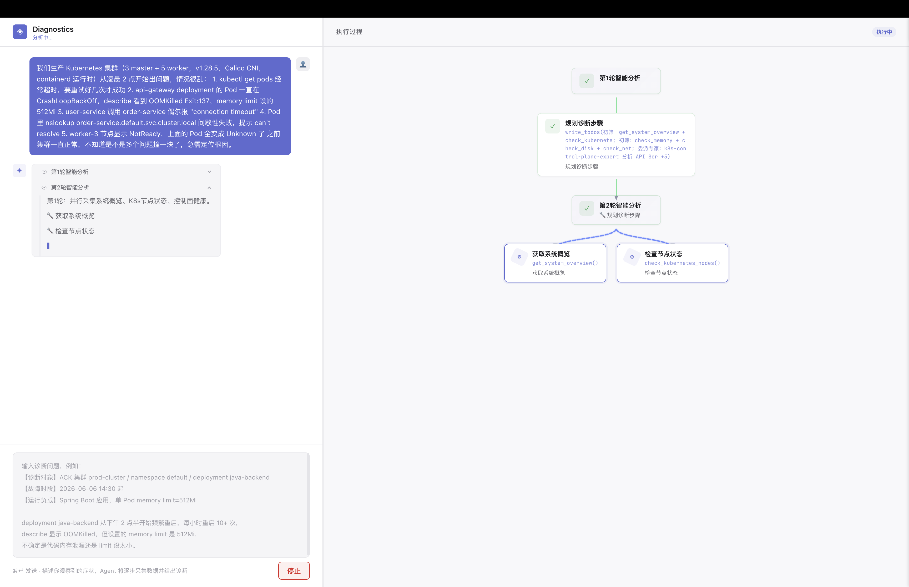
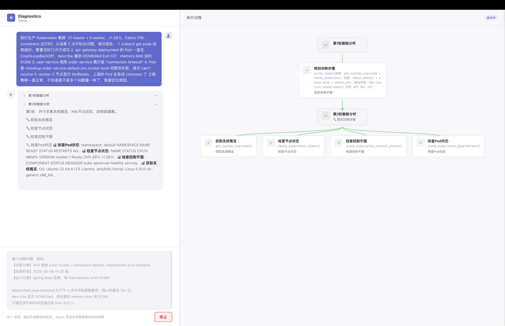
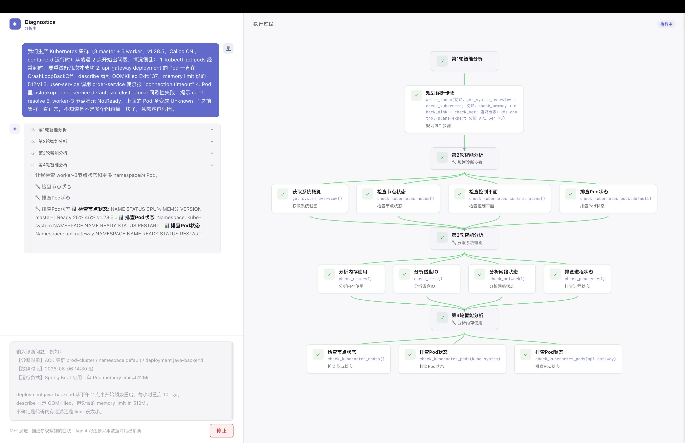
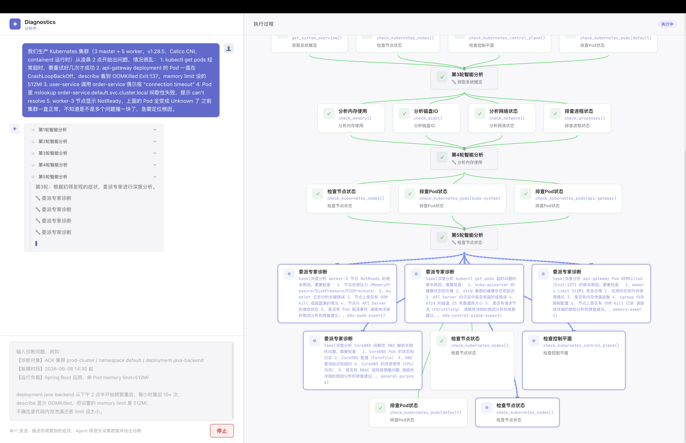
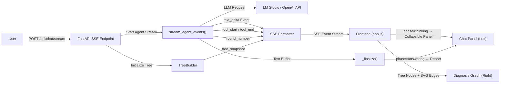
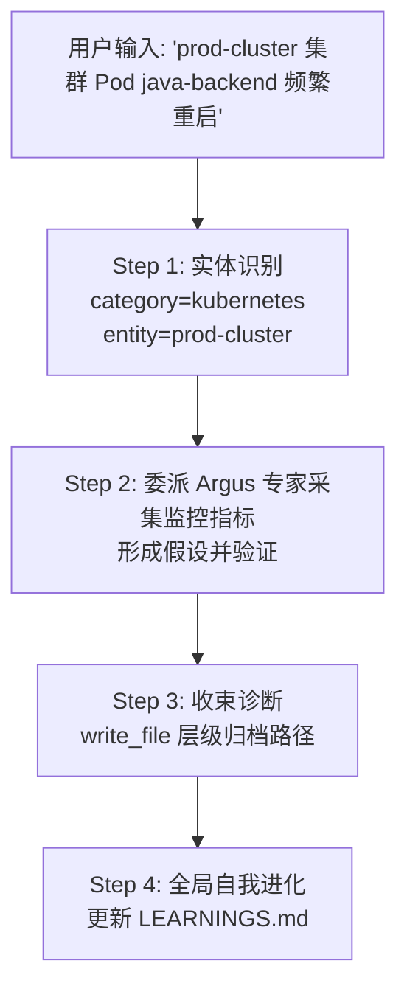
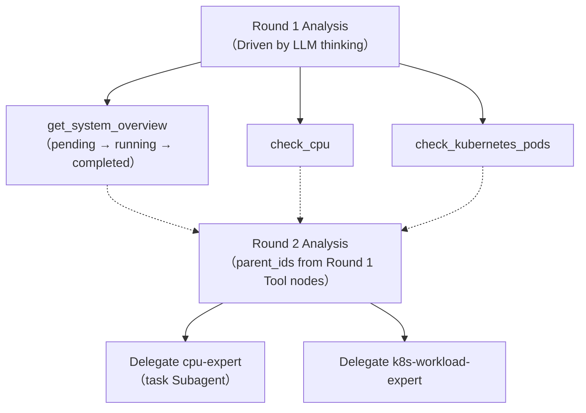
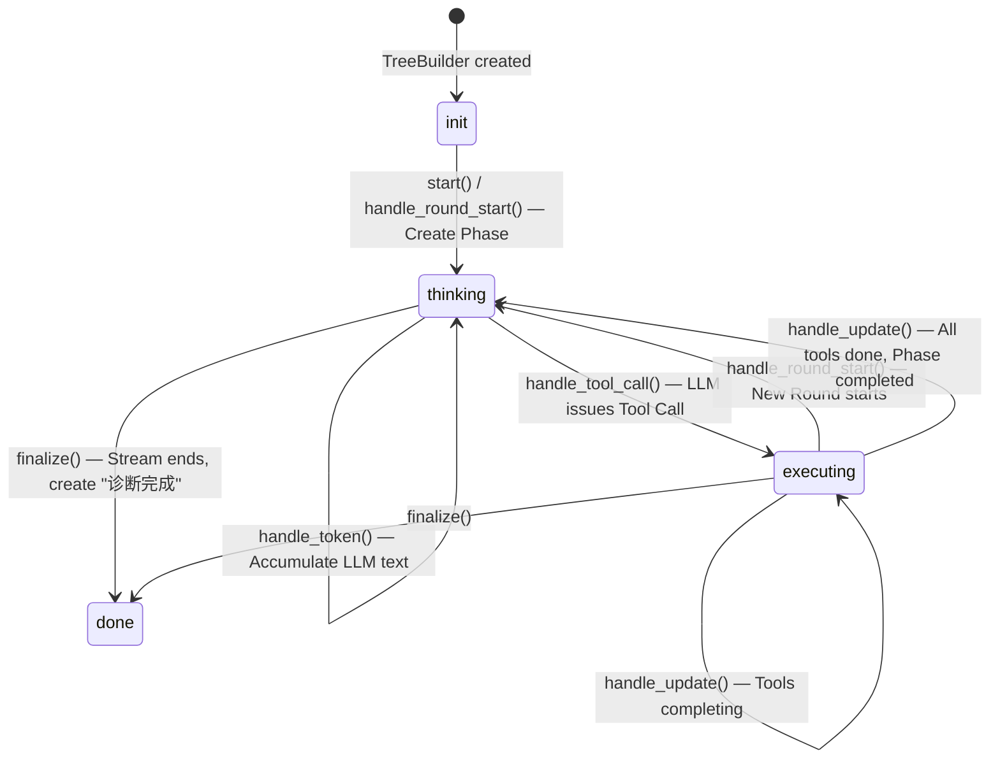
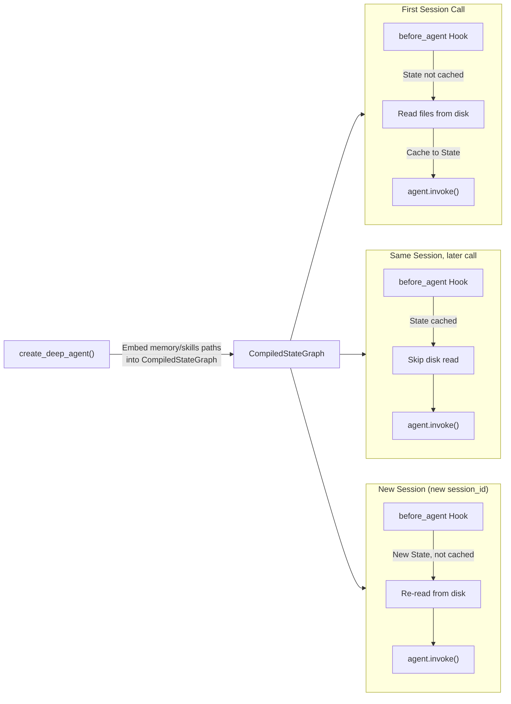
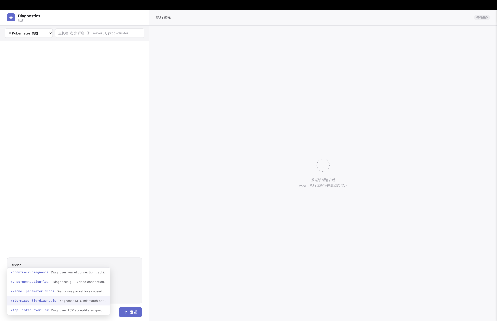

# Diagnostics — AI 驱动的系统故障诊断 Agent

一个结合 LLM 与领域 Tool、自动执行 Linux / Kubernetes / GPU 故障排查的智能诊断平台。采用 **Coordinator 初筛 + 7 个 Domain Expert (Skills-First) 深度分析** 架构，假设驱动、证据收束。报告路径由程序预生成（UUID 命名）并通过 Prompt 变量注入，按实体（主机 / K8s 集群）层级化持久归档到文件系统，诊断前自动关联同一运维对象的历史故障。Frontend 3:7 双栏布局：左侧按诊断 Round 展示可折叠的推理过程与 Markdown 报告，右侧实时渲染诊断执行树。







## 目录

- [架构概览](#架构概览)
- [快速开始](#快速开始)
- [持久化报告与历史关联](#持久化报告与历史关联)
  - [设计动机](#设计动机)
  - [文件系统层级组织](#文件系统层级组织)
  - [报告命名规范](#报告命名规范)
  - [历史关联流程](#历史关联流程)
  - [关键实现](#关键实现)
  - [历史诊断流程图持久化](#历史诊断流程图持久化)
  - [设计动机](#设计动机-1)
  - [数据结构](#数据结构)
  - [关键实现](#关键实现-1)
  - [API 端点](#api-端点)
  - [前端数据流转](#前端数据流转)
  - [历史报告页面 UI](#历史报告页面-ui)
  - [Markdown 渲染](#markdown-渲染)
- [动态诊断图：原理与实现](#动态诊断图原理与实现)
  - [设计哲学](#设计哲学)
  - [核心数据结构](#核心数据结构)
  - [生命周期与状态机](#生命周期与状态机)
  - [Phase（轮次）创建策略](#phase轮次创建策略)
  - [节点描述：完全由 LLM 驱动](#节点描述完全由-llm-驱动)
- [数据流路径](#数据流路径)
  - [端到端时序](#端到端时序)
  - [事件类型一览](#事件类型一览)
- [后端关键实现](#后端关键实现)
  - [事件流处理（streaming.py）](#事件流处理)
  - [诊断树构建器（step_tracker.py）](#诊断树构建器)
  - [SSE 端点（app.py）](#sse-端点)
  - [Agent 工厂（factory.py）](#agent-工厂)
- [前端关键实现](#前端关键实现)
  - [诊断树可视化](#诊断树可视化)
  - [思考过程折叠面板](#思考过程折叠面板)
  - [工具详情弹窗](#工具详情弹窗)
- [技能选择器](#技能选择器)
- [项目结构](#项目结构)
- [配置](#配置)
- [License](#license)

## 架构概览



**数据流分两路**：推理过程中的 `text_delta(phase=thinking)` 流入左侧按 Round 创建的折叠块（含 LLM 推理、🔧 Tool Call、📊 Tool Result）；Stream 结束时 `_finalize()` 将 Coordinator 最后一轮的 Buffer 文本以 `phase=answering` 发送到回答区，形成最终诊断报告。

技术栈：

| 层 | 技术 |
|---|---|
| Agent 框架 | `deepagents` — 支持 Subagent 委派、文件系统 Backend、Skill 加载 |
| LLM 接入 | `langchain-openai` — 兼容 OpenAI API 的本地/远程模型 |
| Web 框架 | `FastAPI` — SSE 流式响应 |
| Frontend | 原生 HTML + CSS + JavaScript，零构建工具 |
| 可视化 | SVG 边线 + 自定义 BFS 层级布局 |
| 运行环境 | `uvicorn` ASGI 服务器 |

## Hypothesis-Driven Diagnosis Ledger

诊断 Agent 采用**假设驱动诊断机制**：维护结构化的诊断台账（Diagnosis Ledger），通过假设形成 → 验证 → 评估 → 报告的核心循环逐步逼近根因，而非固定步骤数的线性流程。

### 核心概念

| 概念 | 说明 |
|------|------|
| **DiagnosisLedger** | 诊断台账 — 持久化在 LangGraph State 中的结构化诊断记忆 |
| **Hypothesis Tree** | 假设树 — 最多 3 个/层，支持多级子假设深化 |
| **Active Path** | 活动路径 — 当前探索路径栈，支持回溯 |
| **Phase** | 诊断阶段 — `understand` → `hypothesize` → `verify` → `evaluate` → `report` → `backtrack` |
| **Exit Conditions** | 退出条件 — 根因确认(p≥80%) / 假设穷尽 / 证据饱和(3×inconclusive) |

### 数据流

```
awrap_model_call (每次LLM调用前)
  ├── 获取当前 ledger (self._current_ledger > request.state > new_ledger)
  ├── render_ledger_context() → 注入 system message
  └── 等待 LLM 响应 → ExtendedModelResponse → 同步回 state

awrap_tool_call (每次工具调用后)
  ├── 诊断工具 → 自动记录证据到活动假设
  ├── record_round() 记录步骤
  └── 台账工具 → 持久化 + stream_writer 推送 ledger_snapshot
```

### 三个台账管理工具

| 工具 | 调用阶段 | 作用 |
|------|---------|------|
| `commit_hypotheses` | HYPOTHESIZE | 提交 ≤3 个假设（按概率降序），自动选择最高概率进入 verifying |
| `select_path` | EVALUATE | 选择 1 条路径深入，未选中自动 deprioritized（可回溯） |
| `record_finding` | VERIFY 后 | 记录 confirmed/refuted/inconclusive，自动检查退出条件 |

### 前端假设树

右侧面板提供"执行树"和"假设树"两个标签页。假设树实时渲染假设节点的层级结构：状态、概率条、支持/反驳证据、验证工具，以及"当前聚焦"标记。

### 退出条件（进入 REPORT 的判定）

满足以下任一即进入报告阶段，不依赖固定步骤数：
1. **根因确认**：某假设 confirmed 且 probability≥80%，假设已足够具体
2. **假设穷尽**：所有可探索路径（含回溯）都 refuted/dead_end
3. **证据饱和**：连续 3 次 record_finding 返回 inconclusive
4. **无合理假设**：EVALUATE 阶段无法提出合理的新假设

## 快速开始

```bash
# 安装依赖
pip install -e .

# 配置环境变量
cp .env.example .env
# 编辑 .env，设置 DIAGNOSTICS_BASE_URL 指向你的 LLM 服务（如 LM Studio）

# 启动服务
python main.py
# 访问 http://127.0.0.1:8000
```

## 持久化报告与历史

### 设计动机

运维诊断不是一次性事件——同一个主机或 K8s 集群可能反复出现相同或关联的故障。本系统将每次诊断报告**按运维实体层级化持久存储**，使 Coordinator 能够：
- 事后回放诊断过程，复盘根因定位路径
- 对比不同时间的诊断策略和结论
- 在全局经验库（LEARNINGS.md）中积累跨实体的通用诊断模式

### 文件系统层级组织

报告按**实体类别** → **实体名称** → **日期+症状** 三级结构归档。GPU 以 K8s 形态提供，归属到所在集群目录：

```
agent_data/reports/
├── hosts/                                   ← 传统物理/虚拟机
│   ├── server01/
│   │   ├── 2026-06-08_server01_oom-killed.md
│   │   └── 2026-06-09_server01_cpu-load-high.md
│   └── db-node-03/
│       └── 2026-06-09_db-node-03_disk-io-saturation.md
│
└── kubernetes/                              ← 所有 K8s 集群（含 GPU）
    ├── prod-cluster/
    │   ├── 2026-06-09_prod-cluster_pod-java-backend-crashloop.md
    │   ├── 2026-06-09_prod-cluster_node-worker3-notready.md
    │   └── 2026-06-09_prod-cluster_gpu-gpu01-memory-oom.md
    └── staging-cluster/
        └── ...
```

### 报告命名规范

```
{YYYY-MM-DD}_{entity_name}_{brief-symptom}.md
```

| 组成部分 | 说明 | 示例 |
|---|---|---|
| `YYYY-MM-DD` | 诊断日期，便于按时间搜索 | `2026-06-09` |
| `entity_name` | 主机名或集群名，便于按实体过滤 | `server01`, `prod-cluster` |
| `brief-symptom` | 英文简短症状（小写，连字符分隔） | `cpu-load-high`, `gpu-memory-oom` |

搜索示例：
- 按时间过滤：`ls reports/hosts/server01/2026-06*`
- 按实体列出所有报告：`ls reports/kubernetes/prod-cluster/`
- 跨实体搜索根因：`grep -r "OOMKilled" reports/`

### 诊断流程

以下一次完整的诊断请求为例，展示 Coordinator 的工作流程：



**全局级记忆（LEARNINGS.md）**：跨实体的通用诊断模式和方法论积累。

### 关键实现

**1. FilesystemBackend 天然支持**

现有的 `CompositeBackend` 已将 `/agent_data/` 路由到 `FilesystemBackend`，Agent 通过 `write_file("/agent_data/reports/hosts/server01/...")` 写入的报告直接落盘持久化，无需任何后端改动。

**2. Prompt 驱动，零代码新增**

实体识别、路径规划等全部逻辑通过 `prompt.py` 中的任务指令驱动，无需新增 Python 模块。Coordinator 在诊断开始时被指令：
- 提取运维对象 → 确定归档路径
- 报告写入选定路径 → 更新 LEARNINGS.md

**3. 目录自动初始化**

`factory.py` 在 Agent 构建时自动创建 `reports/hosts/` 和 `reports/kubernetes/` 目录，确保 Agent 首次写入时路径已就绪。

**4. 报告路径程序生成与变量注入**

报告路径由程序预生成，不依赖 LLM。流程如下：

```
Frontend 选择实体类型 + 输入实体名
  → POST /api/chat/stream (entity_type + entity_name)
    → app.py: _make_report_path() 生成 UUID 路径
      格式: /agent_data/reports/{hosts|kubernetes}/{entity}/{YYYY-MM-DD-HHmmss}-{uuid8}.md
    → make_system_prompt(report_path) 将路径渲染进 SYSTEM_PROMPT
    → build_agent(system_prompt=...) 创建携带精确路径的 Agent
    → Agent 直接使用 prompt 中的 {report_path} 写入报告
      （无需 LLM 自行总结症状或拼接文件名）
```

关键技术点：
- `prompt.py` 中报告路径用 `{report_path}` 占位，`make_system_prompt(report_path)` 在每次请求时格式化模板
- `factory.py` 的 `build_agent()` 接受可选 `system_prompt` 参数，按请求动态构建 Agent
- 文件名使用 `日期-时间-UUID` 格式，避免依赖 LLM 的症状总结，保证唯一且可追溯

### 历史诊断流程图持久化

除报告文本外，每次诊断的**完整执行树（流程图数据）**也随报告一同保存，支持事后回放诊断过程。

#### 设计动机

实时诊断图在 Page 刷新后即丢失——运维人员需要在事后复盘诊断路径、对比不同时间的诊断策略，或在报告页面中直观查看 Agent 的执行链路。因此诊断树数据结构在诊断结束时与报告一同序列化归档。

#### 数据结构

报告目录中同时存在两种文件：

```
agent_data/reports/kubernetes/prod-us-east/
├── 2026-06-17-201851-6bc163c0.md              # Markdown 诊断报告
└── 2026-06-17-201851-6bc163c0.result.json     # 诊断流程图 + 元数据
```

`result.json` 格式：

```json
{
  "entity_type": "kubernetes",
  "entity_name": "prod-us-east",
  "duration_secs": 126.5,
  "assistant_text_chars": 4793,
  "event_counts": { "text_delta": 810, "tool_start": 44, "tool_end": 44 },
  "report_file": "kubernetes/prod-us-east/2026-06-17-201851-6bc163c0.md",
  "tree": {
    "steps": [
      {
        "id": "n1",
        "title": "第1轮智能分析",
        "parent_id": null,
        "parent_ids": [],
        "status": "completed",
        "node_type": "phase",
        "description": "",
        "tool_name": "",
        "tool_args": ""
      }
    ]
  }
}
```

#### 关键实现

**1. 序列化（`app.py` → `_save_result()`）**

诊断流结束时，`TreeBuilder` 的完整节点数据通过 `_serialize_tree()` 提取为可序列化的字典列表，字段 `status` 和 `node_type` 取其 `.value`（字符串），与 Markdown 报告一起写入文件系统：

```python
def _save_result(report_path, tree, entity_type, entity_name, duration, ...):
    data = {
        "entity_type": entity_type,
        "entity_name": entity_name,
        "duration_secs": round(duration, 1),
        "event_counts": dict(event_counters),
        "tree": {"steps": _serialize_tree(tree)},
    }
    result_path = stem.with_suffix(".result.json")
    result_path.write_text(json.dumps(data, ensure_ascii=False))
```

**2. API 端点**

| 端点 | 用途 | 返回 |
|---|---|---|
| `GET /api/history` | 扫描 `reports/` 目录，列出所有历史会话 | 列表（含 `entity_type`、`entity_name`、`duration_secs`、`tree` 等） |
| `GET /api/history/{result_file}` | 获取单个会话的完整诊断树 | `result.json` 全部内容 |
| `GET /api/report/{report_file:path}` | 获取 Markdown 报告原文 | `{ "content": "..." }` |

历史列表同时涵盖有 `result.json` 的完整记录和仅有 `.md` 的旧格式报告（后者无诊断图），按时间倒序排列。

**3. 前端数据流转**

历史页面的渲染分为两个独立过程：

```
用户点击历史条目
  → openHistory(item)
    ├── GET /api/report/{report_file} → renderMarkdown() → 左侧报告面板
    └── item.tree.steps → renderHistoryGraph() → 右侧诊断图
```

诊断树的反序列化需要注意字段命名转换——后端 Python 使用 `snake_case`（`parent_id`、`node_type`、`tool_name`），前端 JS 使用 `camelCase`（`parentId`、`nodeType`、`toolName`）。`renderHistoryGraph()` 在构建历史图节点时显式映射：

```javascript
hg.nodes.set(s.id, {
  id: s.id,
  title: s.title,
  parentId: s.parent_id || null,    // ← 蛇形→驼峰
  parentIds: parentIds,
  nodeType: s.node_type || "tool",  // ← 蛇形→驼峰
  toolName: s.tool_name || "",      // ← 蛇形→驼峰
  toolArgs: s.tool_args || "",
  status: "completed",              // ← 历史节点统一标记为已完成
  ...
});
```

**4. 历史报告页面 UI**

进入历史页面后，右侧原"执行过程"面板切换为历史查看器：

- **顶部工具栏**：返回按钮 + 诊断标题（实体类型/名称 · 耗时）
- **左半区**：Markdown 报告，支持标题、粗斜体、代码块、表格、有序/无序列表、引用块等完整 GFM 语法渲染，行内单个换行自动转为 `<br>`
- **右半区**：诊断流程图，使用与实时诊断共用的 BFS 层级布局、`createNodeDOM()` 节点渲染和 SVG 贝塞尔曲线边线绘制。所有节点绿色标记为"已完成"状态
- **拖拽分割线**：支持拖动中间分割条调整左右面板比例（20%–80%）

**5. Markdown 渲染**

`renderMarkdown()` 是共享函数，同时服务于实时诊断和历史报告。它按四阶段处理：

| 阶段 | 处理内容 | 示例 |
|---|---|---|
| Phase 1 | 代码块、行内代码、标题（h1-h3）、粗体、斜体、链接、引用块 | `` `code` `` → `<code>`, `# Title` → `<h1>` |
| Phase 2 | 表格检测 | `\| A \| B \|` 连续行 → `<table><thead><tbody>` |
| Phase 3 | 有序/无序列表 | `- item` → `<ul><li>`, `1. item` → `<ol><li>` |
| Phase 4 | 段落包裹、换行处理、标签清理 | `\n\n` → `</p><p>`, `\n` → `<br>` |

输入文本在 Phase 1 之前先经 `escNoBr()` 转义 `<` `>` `&` `"` 防止 XSS 注入。

---

## 动态诊断图：原理与实现

本项目最核心的特性是**右侧面板中随诊断过程实时生长的执行树**。它不是静态图示，而是一个与 Agent ↔ LLM 交互周期同步更新的动态数据结构。

### 设计哲学

诊断树完全由 **LLM 的实时输出驱动**，而非 Backend 硬编码的步骤模板。核心理念：

- **不预设诊断路径**：Agent 根据 Tool 返回的数据，自主决策下一步检查什么
- **LLM 提供语义描述**：每个节点的标题和描述来自 LLM 的思考文本，而非固定字符串
- **树结构反映实际推理**：父子关系代表了 Agent 的真实决策链

### 核心数据结构

诊断树由三种节点类型构成：

```python
class NodeType(Enum):
    ROOT  = "root"    # 保留定义，实际未使用——Phase 直接作为根节点
    PHASE = "phase"   # Round 节点："第N轮智能分析"
    TOOL  = "tool"    # Tool 节点："分析CPU指标"、"排查Pod状态"等
    TASK  = "task"    # Task 委派节点（预留扩展）
```

树的结构层次（以两轮诊断为例）：



**Phase 节点直接作为诊断树的根**：树启动时 `tree.start()` 直接创建第 1 Round Phase（`parent_ids=[]`），后续每 Round Phase 的 `parent_ids` 指向上一 Round 所有 Tool 子节点，形成链式因果连接。不再有独立的"开始诊断"根节点。

每个节点携带的字段：

| 字段 | 说明 |
|---|---|
| `id` | 唯一标识（如 `n1`, `n2`） |
| `title` | 中文显示名称（Tool 名→中文映射表） |
| `parent_id` / `parent_ids` | 父节点引用（PHASE 节点支持多父） |
| `status` | `pending` / `running` / `completed` / `error` |
| `description` | 由 LLM 输出驱动，描述此步骤的目的 |
| `tool_name` / `tool_args` | Tool 函数名和参数，Frontend 展示为 `check_cpu(profile="default")` |

### 生命周期与 State Machine

`TreeBuilder` 内部维护一个有限 State Machine，每个转换由外部 Event 触发：



**State 转换要点**：
- `thinking`：LLM 正在流式输出文本，Phase 为 RUNNING
- `executing`：Tool 正在执行，`handle_tool_call()` 在当前 Phase 下挂载 Tool 子节点
- 新 Phase 由 `handle_round_start()` 创建——当 LangGraph 进入下一轮 model 节点时触发
- 诊断结束由 `finalize()` 显式创建 **"诊断完成"** 终态节点

### Phase（Round）创建策略

整个诊断由多个 **Round** 组成，每 Round 对应一次 LangGraph **model 节点进入**。Phase 创建采用**事件驱动**模式，不再依赖 token 流检测：

```mermaid
flowchart TD
    START["Agent Start"] -->|tree.start()| P1["Phase 1 RUNNING"]
    START -->|"LangGraph stream"| M1["model node (#1)"]
    M1 -->|"LLM text + tool_calls"| T1["tools node → tool_end"]
    T1 -->|"Tools return, next model entry"| M2["model node (#2)"]
    M2 -->|"round_start event"| P2["Phase 1 COMPLETED<br/>Phase 2 RUNNING"]
    M2 --> T2["tools node"]
    T2 -->|"..."| MN["model node (#N)"]
    MN -->|"round_start event"| PN["Phase N RUNNING"]
    MN -->|"Stream End"| END["finalize() → '诊断完成'"]
```

**关键流程**：
1. `streaming.py` 检测到 LangGraph `tools → model` 节点转换 → emit `round_start` 事件
2. `app.py` 收到 `round_start` → `tree.handle_round_start(N)` → Phase N-1 COMPLETED + Phase N RUNNING
3. Phase 创建与 LLM 调用 1:1 对应，语义清晰

**parent_ids 继承**：新 Phase 的 `parent_ids` 指向上一 Round 所有 Tool 子节点，形成 BFS 层级布局中的因果链连线。

### 报告内容分发

报告通过 **`write_file` 捕获**机制分发，而非文本解析：

```
LLM → write_file(report_path, content="# 故障诊断报告...")
  → middleware 检测 write_file 命中 report_path
    → stream_writer → custom event "report_content"
      → streaming.py → text_delta(phase="answering")
        → 前端 answer-body
        → app.py report_text → .md 文件（仅报告）
```

`assistant_text`（全量文本）用于 Agent 跨会话记忆；`report_text`（仅 answering）用于持久化 `.md` 文件。

## 数据流路径

### 端到端时序

以下是一次完整诊断请求中各组件的交互时序：

```
┌──────────┐    ┌───────────┐    ┌──────────────────┐    ┌──────────────┐    ┌─────┐
│  Browser │    │  FastAPI  │    │  stream_agent_   │    │  TreeBuilder │    │ LLM │
│ (app.js) │    │  (app.py) │    │  events()        │    │              │    │     │
└────┬─────┘    └─────┬─────┘    └────────┬─────────┘    └──────┬───────┘    └──┬──┘
     │                │                   │                     │               │
     │ POST /api/chat │                   │                     │               │
     │───────────────>│                   │                     │               │
     │                │ tree.start()      │                     │               │
     │                │──────────────────>│                     │               │
     │  SSE session   │                   │ tree_snapshot(phase)│               │
     │<───────────────│                   │<────────────────────│               │
     │                │                   │                     │               │
     │                │ agent.astream()   │                     │               │
     │                │──────────────────>│                     │               │
     │                │                   │ ── LLM chunk ──>    │               │
     │                │                   │                     │  "CPU usage   │
     │                │                   │                     │   high..."    │
     │                │                   │ <── text delta ──   │               │
     │                │                   │                     │               │
     │                │                   │ handle_token(text)  │               │
     │                │                   │────────────────────>│               │
     │ SSE text_delta │                   │                     │               │
     │<───────────────│                   │                     │               │
     │                │                   │                     │               │
     │                │                   │ ── AIMessage ──>    │               │
     │                │                   │   tool_calls=[...]  │               │
     │                │                   │ <── tool_calls ──   │               │
     │                │                   │                     │               │
     │                │                   │ parse <step> tags   │               │
     │                │                   │ build descriptions  │               │
     │                │                   │                     │               │
     │                │                   │ AgentEvent(         │               │
     │                │                   │   "tool_start",     │               │
     │                │                   │   description=...)  │               │
     │                │                   │                     │               │
     │                │                   │ handle_tool_call()  │               │
     │                │                   │────────────────────>│               │
     │                │                   │                     │ create Phase  │
     │                │                   │                     │ + Tool nodes  │
     │                │                   │ tree_snapshot       │               │
     │                │                   │<────────────────────│               │
     │                │                   │                     │               │
     │ SSE tree_      │                   │                     │               │
     │ snapshot +     │                   │                     │               │
     │ tool_start     │                   │                     │               │
     │<───────────────│                   │                     │               │
     │                │                   │                     │               │
     │ ── Frontend renders tree ──>       │                     │               │
     │                │                   │                     │               │
     │                │                   │ ── Tool executes ─> │               │
     │                │                   │ <── ToolMessage ──  │               │
     │                │                   │                     │               │
     │                │                   │ AgentEvent(         │               │
     │                │                   │   "tool_end", ...)  │               │
     │                │                   │                     │               │
     │                │                   │ handle_update()     │               │
     │                │                   │────────────────────>│               │
     │                │                   │                     │ all done →    │
     │                │                   │                     │ next Phase    │
     │                │                   │ tree_snapshot       │               │
     │                │                   │<────────────────────│               │
     │                │                   │                     │               │
     │ SSE tool_end + │                   │                     │               │
     │ tree_snapshot  │                   │                     │               │
     │<───────────────│                   │                     │               │
     │                │                   │                     │               │
     │  ... Multi-Round loop repeats ...  │                     │               │
     │                │                   │                     │               │
     │                │                   │ _finalize()         │               │
     │                │                   │ tree.finalize()     │               │
     │                │                   │────────────────────>│               │
     │                │                   │                     │ mark done     │
     │                │                   │ tree_snapshot       │               │
     │                │                   │<────────────────────│               │
     │                │                   │                     │               │
     │ SSE done +     │                   │                     │               │
     │ tree_snapshot  │                   │                     │               │
     │<───────────────│                   │                     │               │
     │                │                   │                     │               │
     │ ── finalizeGraph() ──>             │                     │               │
```

### Event 类型一览

| SSE Event | 触发时机 | Frontend 行为 |
|---|---|---|
| `session` | 连接建立 | 保存 session_id |
| `text_delta` | LLM 输出文本 / Tool Result / write_file 报告 | phase=thinking → 追加到 "第N轮智能分析" 折叠块；phase=answering → 追加到诊断报告区 |
| `round_start` | LangGraph 进入新 model 节点 | → `handle_round_start()` 创建新 Phase |
| `ledger_snapshot` | 台账工具调用后 | 更新假设树面板 |
| `tree_snapshot` | 树结构发生变化 | **完全重建诊断树**：重新计算 BFS 层级、渲染节点、绘制 SVG 边线 |
| `tool_start` | LLM 发出 Tool Call | 信息性 Event（树由 tree_snapshot 驱动） |
| `tool_end` | Tool 执行完毕 | 信息性 Event（树由 tree_snapshot 驱动） |
| `tool_args_available` | 流式参数到达（updates 模式补全） | 更新 Tool 节点的参数显示 |
| `agent_start` / `agent_end` | Subagent 启动/结束 | 信息性 Event |
| `done` / `cancelled` / `error` | Stream 终止 | 折叠未完成面板、标记完成状态 |

## 后端关键实现

### 事件流处理（`diagnostics/agent/streaming.py`）

核心函数 `stream_agent_events()` 负责将 `deepagents` 的原始流式输出转换为结构化的 `AgentEvent` 序列。

**并发模型**：

```python
async def stream_agent_events(agent, messages, cancel_event, session_id):
    chunk_queue = asyncio.Queue()  # 解耦 Producer 和 Consumer

    # Producer: 将 agent.astream() 的原始数据放入队列
    async def _producer():
        async for raw in agent.astream(...):
            await chunk_queue.put(raw)

    # Consumer: 从队列取数据，用 asyncio.wait 同时监听取消信号
    while True:
        get_task = asyncio.ensure_future(chunk_queue.get())
        cancel_task = asyncio.ensure_future(cancel_event.wait())
        done, pending = await asyncio.wait(
            {get_task, cancel_task},
            return_when=asyncio.FIRST_COMPLETED,
        )
        if cancel_task in done:
            yield AgentEvent("cancelled", ...)
            return
        raw = await get_task
        for evt in _process_chunk(raw, state, session_id):
            yield evt
```

**LangGraph 节点检测与 Round 管理**：

`_process_chunk()` 从 `stream_mode="messages"` 的 metadata 中提取 `langgraph_node` 字段，检测 Coordinator 是否进入 `"model"` 节点。每次 model 节点转换代表一次新的 LLM 调用，`round_number` 在文本处理之前递增，确保所有 `text_delta` Event 携带正确的 Round 号。

```python
node_type = metadata.get("langgraph_node", "")
if is_coordinator and node_type == "model":
    if state._last_node_type != "model":
        state.round_number += 1  # 新 LLM 调用 → 新 Round
```

**Tag 解析与文本路由**：

1. **`_parse_step_tags()`** — 最先执行，提取 `<step>` Tag 声明。当 LLM 纯输出 `<step>` Tag（无其他文本）时，将步骤文本也发送到 Frontend，用 `new_steps_added` 标志避免流式传输中每个中间 chunk 重复发送。

2. **`_parse_think_tags()`** — 解析 `<think>...</think>` 块，区分深度思考内容和最终回答。

3. **文本路由** — Coordinator 的中间推理文本仅发送到 `phase="thinking"`（创建折叠块），并累积到 `_coordinator_text` Buffer。Stream 结束时 `_finalize()` 将 Buffer 内容发送到 `phase="answering"`（回答区正文）。Tool Call 痕迹（🔧）和 Tool Result（📊）同样 Route 到 `phase="thinking"`，归入当前 Round 折叠块。

**Subagent 的 Phase 路由规则**：

```python
def _subagent_phase(path, state) -> str:
    # 所有 Subagent 的输出 → thinking（显示为可折叠的推理过程）
    # Coordinator 的最终报告由 _finalize 处理 → answering
    if len(path) <= 1 or path[0] == "coordinator":
        return "answering"  # Coordinator → answer 区域
    return "thinking"       # Subagent → 折叠块
```

**双通道参数提取**：部分 LLM Backend（如 LM Studio/Qwen）在流式模式下，`messages` 模式的 tool_call 中参数为空，完整参数出现在 `updates` 模式。`_process_chunk()` 同时处理两种模式：

```python
if mode == "messages":
    # 主通道：可能收到空的 tool_call args
    ...
elif mode == "updates":
    # 补全通道：从 LangGraph state 中提取完整参数
    for msg in value["messages"]:
        tcs = getattr(msg, "tool_calls", None)
        if tcs:
            for tc in tcs:
                # 如果 active_tools 中已有记录但 args 为空，补全
                if info and not info.get("args"):
                    info["args"] = tc_args
                    events.append(AgentEvent("tool_args_available", ...))
```

### TreeBuilder（`diagnostics/server/step_tracker.py`）

`TreeBuilder` 是一个**被动响应式**构建器，它在接收到 Event 时同步更新内部树 State。

```python
@dataclass
class TreeBuilder:
    nodes: dict[str, TreeNode]           # id → TreeNode
    node_order: list[str]                # 保持插入顺序
    state: str = "init"                  # State Machine
    _current_phase_id: str               # 当前活跃 Phase
    _last_tool_child_ids: list[str]      # 上一 Round 创建的 Tool 节点 ID
    think_buffer / think_segments        # LLM 思考文本累积
    answer_buffer                        # LLM 回答文本累积
```

**Snapshot 生成**：每次树 State 变更时，调用 `_snapshot_event()` 生成完整的节点列表 Snapshot：

```python
def _snapshot_event(self) -> dict[str, Any]:
    return {
        "type": "tree_snapshot",
        "steps": [
            {
                "id": node.id,
                "title": node.title,
                "parent_id": node.parent_id,
                "parent_ids": node.parent_ids,
                "status": node.status.value,     # "pending"|"running"|"completed"|"error"
                "node_type": node.node_type.value, # "phase"|"tool"|"task"
                "description": node.description,   # LLM 驱动的描述
                "tool_name": node.tool_name,
                "tool_args": node.tool_args,
            }
            for nid in self.node_order
        ],
    }
```

Frontend 接收到 `tree_snapshot` Event 时，**完全重建**可视化树，而非增量更新。这种设计简化了前后端同步，避免增量 diff 的复杂性。

### SSE Endpoint（`diagnostics/server/app.py`）

`_chat_event_stream()` 是 SSE Event 的 Producer。它协调三个关键组件：

```python
async def _chat_event_stream(request, session_id, state, agent, settings):
    tree = TreeBuilder()

    # 1. 发送 session_id
    yield sse("session", {"session_id": session_id})

    # 2. 初始化树（创建首个 Phase 节点）
    for snap in tree.start():
        yield sse("tree_snapshot", snap)

    # 3. 主循环：消费 Agent Event，同时驱动 TreeBuilder
    async for event in stream_agent_events(...):
        if event.name == "text_delta":
            yield sse("text_delta", event.payload)
            # 将 text token 也送入 TreeBuilder
            for tok_evt in tree.handle_token(event.payload["text"]):
                ...

        elif event.name == "tool_start":
            # 将 Tool Call 送入 TreeBuilder（带 LLM 描述）
            tool_calls = [{
                "id": event.payload["id"],
                "name": event.payload["name"],
                "args": event.payload.get("args", {}),
                "description": event.payload.get("description", ""),
            }]
            for snap in tree.handle_tool_call(tool_calls):
                yield sse("tree_snapshot", snap)

        elif event.name == "tool_end":
            # 标记 Tool 完成 → 可能触发新 Phase 创建
            for snap in tree.handle_update(...):
                yield sse("tree_snapshot", snap)

    # 4. Finalize：关闭树，发送最终 Snapshot
    for snap in tree.finalize():
        yield sse("tree_snapshot", snap)

    yield sse("done", {"session_id": session_id})
```

### Agent 工厂（`diagnostics/agent/factory.py`）

使用 `deepagents` 的 `create_deep_agent()` 构建主 Agent，核心配置如下：

- **7 个 Subagent**（系统层 + K8s 层）：
  - 系统层：`cpu-expert`, `memory-expert`, `disk-io-expert`, `network-expert`, `gpu-expert`
  - K8s 层（二合一，遵循 Kubernetes 控制面/数据面边界）：
    - `k8s-cluster-expert` — 集群基础设施：控制面 + 节点 + CoreDNS + etcd + 跨层级联
    - `k8s-workload-expert` — 工作负载：Pod/Deployment/Service/Helm 应用层诊断
- **双层存储 Backend**：`CompositeBackend` — `/agent_data/` 路径 Route 到 `FilesystemBackend`（虚拟文件系统，支持 `read_file`/`write_file`/`edit_file`），其他使用 `StateBackend`（内存 State）。所有诊断报告通过此 Backend 写入 `reports/` 目录层级归档。
- **报告目录初始化**：`build_agent()` 时自动创建 `agent_data/reports/hosts/` 和 `agent_data/reports/kubernetes/` 目录，确保 Agent 首次写入就绪。
- **Memory 与 Skill 加载**：
  - `memory` 路径（`AGENTS.md`、`LEARNINGS.md`）和 `skills` 路径在 `create_deep_agent()` 时固化到 `CompiledStateGraph`
  - 具体文件内容在 `before_agent` Hook 中按需从磁盘读取，缓存于 LangGraph State 中
  - **同 Session 内复用缓存**，无需重复读取；**新 Session**（新 session_id）自动重新从磁盘加载，无需重启服务



## 自定义 Middleware

系统通过 5 个自定义 `AgentMiddleware` 实现参数校准、范围守卫、工具去重、假设台账和结果压缩。它们按顺序链式处理每个工具调用：

```
Tool Call → param_override → scope_guard → dedup → ledger → offload → 实际执行
```

每个中间件在链中的位置决定了它的预处理（调用前）和后处理（调用后）生效时机：**越靠前的中间件，预处理越早执行；后处理则反向，越靠后的中间件越早拿到工具返回结果**。

---

### 1. ToolParamOverrideMiddleware

**职责**：根据 session 配置强制修正 LLM 生成的工具参数，防止幻觉。

**工作流程**：

```
awrap_tool_call 被调用
  ├─ 工具是 task / write_file / 台账工具？ → 直接透传
  ├─ 没有 session 配置？ → 直接透传
  └─ 遍历 _flat_config 中的每个 key：
       ├─ 是 meta key（task_type / fault_time_range）？ → 跳过
       ├─ 是列表类型？ → 跳过（无法确定单个值）
       ├─ LLM 提供了该参数？
       │   ├─ 属于 strict_set → 强制覆盖为 config 值
       │   └─ 属于 flexible → 信任 LLM 提供的值
       └─ LLM 未提供该参数？
           ├─ 属于 strict_set AND 工具签名接受 → 自动注入
           └─ 属于 flexible AND 工具签名接受 → ⛔ 拦截
              （中间件无法猜测多个可选值中应填哪个）
```

**参数分类**：

| 分类 | 容器模式参数 | 主机模式参数 | 行为 |
|------|------------|------------|------|
| **Strict** | `cluster_name`, `start_time`, `end_time` | `hostname`, `start_time`, `end_time` | 无条件覆盖/注入 |
| **Flexible** | `namespace`, `pod_name` 等 | — | LLM 提供→信任；未提供→拦截 |
| **Skip** | `task`, `write_file`, 台账工具 | 同左 | 直接透传 |

**核心依赖**：`_build_param_map(tools)` — 用 `inspect.signature(fn)` 遍历所有工具，提取 `{工具名 → {参数名集合}}`。**仅对工具签名中实际存在的参数**注入/拦截。

**典型场景**：

```
config = {"task_type":"container", "cluster_name":"prod-us-east",
          "fault_time_range": {"start_time":"2026-07-01 15:00", ...}}

LLM → check_kubernetes_pods(cluster_name="wrong")
  → strict override → cluster_name="prod-us-east"  ← 修正

LLM → check_kubernetes_pods()  # 无参数
  → strict inject → cluster_name="prod-us-east"   ← 注入
  → flexible missing: namespace                    ← ⛔ 拦截
  → 返回: "⛔ [参数拦截] check_kubernetes_pods 缺少必要参数 namespace"

LLM → check_kubernetes_pods(namespace="kube-system")
  → strict inject → cluster_name="prod-us-east"
  → flexible: LLM 提供了 namespace → 信任 "kube-system"  ← 放行
```

**移植要点**：生产工具必须用 `@tool` 装饰、参数名与 config key 一致、同一工具 mock/live 签名完全相同。`_build_param_map` 依赖工具函数暴露的 `func`/`coroutine` 属性。

---

### 2. ScopeGuardMiddleware

**职责**：拦截超出预发现 scope 的 K8s 工具调用，防止 LLM 漫游到无关资源。

**工作流程**：

```
awrap_tool_call 被调用
  ├─ 没有 diagnostic_scope？ → 直接透传（scope 未启用）
  ├─ namespace 参数存在且不等于 allowed_namespace？
  │   → ⛔ 拦截: "namespace xxx 不在诊断范围内"
  ├─ node_name 参数存在且不在 allowed_nodename 中？
  │   → ⛔ 拦截（精确匹配 + 子串匹配）
  └─ pod_name 参数存在且不在 allowed_podname 中？
      → ⛔ 拦截
```

**被检查的工具集**（`frozenset` 硬编码）：

| 被检查参数 | 受检工具 |
|-----------|---------|
| `namespace` | `check_kubernetes_pods`, `get_pod_logs`, `get_pod_events`, `get_namespaces`, `list_deployments`, `list_services` |
| `node_name` | `get_node_info` |
| `pod_name` | `get_pod_logs`, `get_pod_events` |

**ScopeLimit 创建流程**：

```
用户请求
  → ScopeLimit.get_control_plane_metrics(cluster)
     → 控制面内存 >80% AND 可用 <2GB？ → 拒绝诊断
  → ScopeLimit.discover(cluster, namespace, workload, pod)
     ├── mock: _MOCK_POD_NODE_MAP 查表
     │   例: "prod-us-east:default:api-gateway" → 3个Pod,3个节点,3个主机IP
     └── production: K8s API 查询（待实现）
  → 返回 ScopeLimit(allowed_namespace, allowed_nodename, allowed_podname, ...)
```

**匹配策略**：`_is_in_scope(value, allowed)` — 先精确匹配，再子串匹配（如 `"worker-3"` 匹配 `"eklet-worker-3-abc"`），空值直接放行。仅拦截 K8s 资源类工具，Argus 监控工具和 host 诊断工具不受 scope 限制。

**典型场景**：

```
Scope: namespace="default", nodename=["worker-3","worker-5"]

k8s-expert → get_pod_logs(namespace="kube-system", pod_name="coredns")
  → ⛔ namespace "kube-system" ≠ allowed "default"

k8s-expert → get_pod_logs(namespace="default", pod_name="api-gateway-xyz")
  → ✅ 放行

k8s-expert → get_node_info(node_name="worker-7")
  → ⛔ "worker-7" 不在 ["worker-3","worker-5"] 中
```

**移植要点**：受检工具名硬编码在三组 `frozenset` 中，生产 K8s 工具必须使用**完全相同的函数名**。`discover()` 和 `get_control_plane_metrics()` 的生产版需实现 K8s API / 监控 API 查询。

---

### 3. ToolDedupMiddleware

**职责**：在 session 内阻止相同（工具名 + 参数）的重复调用，含熔断器防止连续失败重试，跨 Agent 共享缓存。

> 从 `DiagnosisLedgerMiddleware` 中抽出，保持 ledger 专注假设管理。

**工作流程**：

```
awrap_tool_call 被调用
  ├─ 工具是 task / write_file / 台账工具？ → 直接透传（不去重）
  │
  ├─ P0: 内存缓存查找
  │   ├─ cache_key 命中 AND fail_count==0？ → 返回缓存结果（去重命中）
  │   ├─ fail_count >= 2？ → ⛔ 返回熔断消息（禁止重试）
  │   └─ fail_count==1？ → 返回失败警告 + 累加计数器
  │
  ├─ 跨Agent缓存查找（shared_backend）
  │   └─ key: /_dedup_cache/工具名:JSON参数
  │       命中？ → 写入内存缓存 + 返回
  │
  ├─ 执行工具 → 拿到 result
  │
  └─ 缓存结果
      ├─ 空结果 / 错误结果（<50字符 + "not found"等关键字）？ → 不缓存
      ├─ 网络失败（timeout等）？ → 缓存 + fail_count=1
      ├─ 成功结果 → 缓存 + fail_count=0
      └─ 持久化到 shared_backend（跨Agent共享）
```

**缓存 key 格式**：`"工具名:JSON序列化参数"`，参数按 key 排序后 JSON 序列化，确保 `{a:1,b:2}` 和 `{b:2,a:1}` 生成相同 key。

**熔断条件**：同一 cache_key 连续失败 `_TOOL_FAILURE_BREAKER` 次（默认 2）→ 返回 `"⛔ [系统熔断] 已连续失败N次，禁止重试此工具"`。

**跨Agent共享**：通过 `for_subagent()` 创建共享缓存的 subagent 实例，Coordinator 和所有 subagent 共用一个 `_tool_call_cache` 字典。缓存命中的结果也写入 `StateBackend`，使后续启动的 agent 也能命中。

**不缓存的场景**：
- 空字符串或 None
- 短文本（<50字符）且含 `not found` / `no data` / `no results` / `error` / `空` 关键字
- 这些结果如果被缓存，会导致后续调用永远返回空 → 诊断死循环

**移植要点**：
- 生产工具返回"无数据"时字符串需含 `not found` / `no data` / `empty` 关键字（否则会被缓存造成死循环）
- 网络超时类错误需能被 `_TOOL_FAILURE_PATTERNS` 正则匹配（含 `timeout` / `connection refused`），否则熔断器不触发
- `for_subagent()` 模式与 ledger 的 `for_subagent()` 完全对称

---

### 4. DiagnosisLedgerMiddleware

**职责**：假设驱动的诊断台账管理 + P1 专家工具阻塞 + 安全机制 + 自动证据采集。

**台账管理**：

通过四个工具驱动假设树生命周期：
- `commit_hypotheses` — 提交 ≤3 个假设（按概率降序），自动选中最高概率进入 verifying
- `select_path` — 选择一条路径深入，未选中的自动 deprioritized（可回溯）
- `record_finding` — 记录 confirmed / refuted / inconclusive，自动检查退出条件
- `backtrack` — 回溯到最近被降级的假设重新验证

**P1 专家工具阻塞**：

```
Coordinator 尝试调用 query_argus_nodes(...)
  → ⛔ 拦截: "query_argus_nodes 是专家专用工具，请通过 task() 委派"
  → Subagent 调用同样工具 → ✅ 放行（_is_subagent=True）
```

受拦截工具：`query_argus_cpu/memory/disk/network/nodes/services/gpu`

**自动证据采集**：
- 每次诊断工具执行后，结果自动写入当前活跃假设的 evidence
- `task()` 委派的专家输出 → `source="expert:host-expert"` + `supports=True`
- 直接工具调用 → `source="tool:check_memory"` + `supports=True`
- `task()` 描述中提及假设 ID（如"验证假设 H1"）→ 证据精确路由到该假设
- 空结果不记录，台账工具和自我管理的工具（`record_finding` 等）不重复采集

**安全机制**：

| 机制 | 阈值 | 触发后行为 |
|------|------|-----------|
| 最大轮次 | ≥20 | 强制进入 REPORT，禁止再调任何诊断工具 |
| Understand 停滞（有数据） | ≥2轮无假设 | 强制要求 `commit_hypotheses` |
| Understand 停滞（无数据） | ≥2轮无诊断工具 | 强制要求采集数据 |
| 委派饱和 | 同 expert+Hn 连续≥2次 | 警告注入：禁止重复委派 |
| Verify 停滞 | 连续3次 task() 无 record_finding | 自动标记 inconclusive |
| Verify 卡住 | ≥8轮未见 finalize | 自动处理 + 强制 REPORT |
| REPORT 停滞 | REPORT 阶段≥2轮未 write_file | 强制要求生成报告 |

**移植要点**：
- `_EXPERT_ONLY_TOOLS` 硬编码 `query_argus_*` 工具名 → 生产 Argus 工具必须同名
- `for_subagent()` 共享 ledger state（非缓存），subagent 的 `before_model` 已禁用
- 跨轮次 offload 将工具结果写入 `FilesystemBackend`，路径格式 `/tool_results/r{轮次}/{工具名}_{参数hash}.txt`

---

### 5. ToolOffloadMiddleware

**职责**：超大工具结果（>32000字符 ≈ 8000 tokens）写入 `FilesystemBackend`，LLM 收到预览+文件路径，用 `read_file`/`grep` 按需检索。

**工作流程**：

```
工具执行完毕 → result 返回
  ├─ 工具不在 tool_names 集合中？ → 直接透传原结果
  ├─ result 是 Command 而非 ToolMessage？ → 直接透传
  ├─ 内容长度 ≤ 32000 字符？ → 直接透传原结果
  └─ 超过阈值 → _offload(result):
       ├─ 完整内容写入 backend: /large_tool_results/{tool_call_id}
       ├─ 生成 head(5行) + tail(5行) 预览
       ├─ 附带关键词 grep 建议（如 check_memory → "OOM\n  Swap\n  RSS"）
       └─ 返回替换后的 ToolMessage（预览 + 文件路径）
```

**关键词建议**（`hint_keywords`）：为每个工具预设常见故障模式的 grep 关键词，LLM 可按建议搜索，也可自由搜索任意模式。这些是**提示**而非限制。

**offload 与 dedup/cross-round 的区别**：

| 机制 | 目的 | 数据存放位置 | 中间件 |
|------|------|------------|--------|
| 去重（dedup） | 阻止同参数重复调用 | `_dedup_cache/工具名:JSON参数`（StateBackend） | ToolDedupMiddleware |
| 跨轮保存（offload） | 让 LLM 按需检索历史结果 | `/tool_results/r{轮次}/{工具名}_{hash}.txt`（FilesystemBackend） | DiagnosisLedgerMiddleware |
| 超大截断（offload） | 压缩当前轮的工具输出 | `/large_tool_results/{call_id}`（FilesystemBackend） | ToolOffloadMiddleware |

**移植要点**：`tool_names` 集合在 `factory.py` 配置 → 需加入生产环境所有诊断工具名。`hint_keywords` 可按生产工具的常见异常模式自定义。

## 前端关键实现

### 诊断树可视化（`static/app.js`）

Frontend 诊断树是一个**自上而下的分层树状图**，核心渲染流程：

**1. BFS 层级计算**：

```javascript
function buildLevels() {
    // 从 parentId 为空的节点（Phase 根节点）开始 BFS
    const roots = [];  // parentId === null 的节点
    const levels = [[...roots]];

    // BFS 遍历，按 parent_ids 关系构建层级
    while (queue.length > 0) {
        const nextLevel = [];
        for (const parentId of currentLevel) {
            for (const id of GRAPH.nodeOrder) {
                if (node.parentIds.includes(parentId)) {
                    nextLevel.push(id);
                }
            }
        }
        levels.push(uniqueNext);
    }
    return levels;
}
```

**2. DOM 渲染**：每个层级渲染为一个 `.tree-level` 弹性容器，层间用 `.tree-connector` 分隔。节点根据类型（Phase/Tool）应用不同的 CSS 类和图标：

```javascript
function createNodeDOM(node) {
    if (node.nodeType === "phase") {
        // ○/🔄/✓ Status 图标 + 标题 + LLM 驱动的描述
    } else {
        // Tool 节点：○/⚙/✓/✕ + 标题 + 函数签名 + 描述
        // 点击触发详情弹窗
    }
}
```

**3. SVG 边线绘制**：使用贝塞尔曲线连接父子节点，Status 驱动样式：

```javascript
function drawAllEdges() {
    // 为每条边计算贝塞尔曲线路径
    // C x1,y1  x1,midY  x2,midY  x2,y2
    const d = `M${x1},${y1} C${x1},${midY} ${x2},${midY} ${x2},${y2}`;

    // Status → 视觉样式
    if (toNode.status === "running") {
        color = "#6c8cff"; dash = 'stroke-dasharray="6 3"';  // 蓝色虚线 + 发光
    } else if (toNode.status === "completed") {
        color = "#4ade80";  // 绿色实线
    } else if (toNode.status === "error") {
        color = "#f87171";  // 红色实线
    }
}
```

边线在 resize 和 scroll Event 时实时重绘，保证拖拽分隔条和滚动画布时连线正确跟随。

**4. 完整重建策略**：每次收到 `tree_snapshot` Event，Frontend 完全重建可视化：

```javascript
function onTreeSnapshot(payload) {
    // 清空本地 GRAPH State
    GRAPH.nodes.clear();
    GRAPH.edges = [];

    // 从 payload.steps 填充
    for (const step of payload.steps) {
        GRAPH.nodes.set(step.id, { ... });
        // 构建边
        GRAPH.edges.push({ from: pid, to: step.id });
    }

    // 完全重建渲染
    renderTree();
}
```

**为什么是完整重建而非增量更新？**
- 树结构可能在任意位置插入新节点（Subagent 调用时）
- BFS 层级可能因新节点加入而整体重排
- 简化同步逻辑，避免前后端 State 不一致
- 渲染性能足够（诊断树节点数通常 < 50）

### 思考过程折叠面板（多 Round 独立，含 Tool Result）

左侧聊天区每 Round LLM 交互产生一个独立折叠块，标题为**"第N轮智能分析"**。

**架构：`thinkSections[]` 数组**

```javascript
// 每个 thinkSection 对象：
{ sectionEl, bodyEl, textEl, labelEl, rawText, startTime, finalized, round }
```

**内容构成：** 每 Round 折叠块包含该 Round 的完整交互内容：
- LLM 推理文本（`phase="thinking"`）
- 🔧 Tool Call 痕迹（`phase="thinking"`）
- 📊 Tool Result（`phase="thinking"`）

**关键行为：**

| 时机 | 行为 |
|---|---|
| Backend 发送 `phase=thinking` | `createThinkSection(round)` → eye SVG + "第N轮智能分析" + chevron，自动展开 |
| 新 Round thinking 到达 | 用 `payload.round` 检测 Round 变化 → `finalizeThink(prev)` → 上一块收起 |
| 用户点击 toggle | 只控制该 section 自身的展开/收起 |
| Stream 结束 | `finishStreamUI()` 最终化未完成的 section；Buffer 的 Coordinator 文本发送到 answer-body |

**DOM 结构：**

```
msg-bubble
├── think-section (Round 1 Analysis, collapsed)
│   ├── think-toggle  [eye SVG] Round 1 Analysis [chevron ▼]
│   └── think-body (hidden) — LLM reasoning + 🔧 Tool Call + 📊 Tool Result
├── think-section (Round 2 Analysis, collapsed)  
│   └── ...
└── answer-section.has-think
    └── answer-body — Final diagnosis report (sent at _finalize with phase=answering)
```

**Round 检测**：Backend 通过 `metadata["langgraph_node"]` 检测 LangGraph 节点转换——Coordinator 每次进入 `"model"` 节点意味着一次新 LLM 调用，在文本处理前递增 `round_number`。Frontend 通过 `payload.round` 与当前 `thinkSections[]` 中最新 section 的 `sec.round` 对比判断新 Round。当检测到新 Round 时，上一 Round section 自动收起（`finalizeThink()`），新 Round section 自动展开。所有中间推理文本（含 `<step>` Tag 解析后的步骤文本）Route 到 `phase="thinking"`，Stream 结束时 `_finalize()` 将 Coordinator 最后一 Round 的 Buffer 文本一次性以 `phase="answering"` 发送到回答区。

### Tool 详情弹窗

点击执行树中的 Tool 节点，弹出详情面板，展示：

- LLM 驱动的步骤描述
- 执行 Status（pending / running / completed / error）
- Tool Call ID（用于调试追踪）

## 技能选择器

在输入框中输入 `/` 即可调出技能列表，支持键盘导航和模糊搜索：



- **`/`** — 弹出全部 19 个诊断技能
- **继续输入** — 实时过滤，按 ID/名称/描述模糊匹配
- **`↓` `↑`** — 键盘上下选择
- **`Enter`** — 确认选中
- **`Esc`** — 关闭列表
- **选中后** — 以 `@skill:xxx` 前缀注入消息，触发技能驱动诊断模式（严格按 SKILL.md Workflow 步骤执行）

技能数据来自 SQLite 数据库，服务启动时自动从 `agent_data/skills/*/SKILL.md` 同步。

## 项目结构

```
diagnostics/
├── main.py                          # 入口：uvicorn 启动
├── pyproject.toml                   # 依赖声明
├── diagnostics/
│   ├── config.py                    # Settings: 环境变量 → 配置对象
│   ├── logging_config.py            # 日志配置
│   ├── agent/
│   │   ├── factory.py               # create_deep_agent() 构建主Agent+子代理
│   │   ├── prompt.py                # 中文系统提示词
│   │   ├── streaming.py             # 事件流处理：阶段路由、工具分组、台账事件分发
│   │   ├── ledger.py                # 诊断台账：假设树、证据链、阶段推导、退出条件
│   │   ├── dedup_middleware.py       # 工具去重中间件：内存缓存 + 跨Agent共享 + 熔断器
│   │   ├── ledger_middleware.py      # 台账中间件：假设管理、P1阻塞、安全机制、offload
│   │   ├── param_override_middleware.py  # 参数覆写中间件：strict注入 + flexible拦截
│   │   ├── scope_guard_middleware.py  # 范围守卫中间件：namespace/node/pod范围检查
│   │   ├── scope_limit.py            # 诊断范围限制：K8s API发现 + 控制面健康检查
│   │   ├── offload_middleware.py      # 结果卸载中间件：超大结果→文件系统
│   │   └── consolidation.py         # 学习记忆整理
│   ├── server/
│   │   ├── app.py                   # FastAPI：SSE端点 + 取消 + 树快照协调
│   │   ├── schemas.py               # ChatRequest 模型
│   │   ├── sessions.py              # 内存会话存储
│   │   ├── sse.py                   # SSE 格式化
│   │   ├── step_tracker.py          # TreeBuilder: 树构建器 + 工具标签映射
│   │   └── skills_db.py             # SQLite 技能数据库
│   └── tools/
│       ├── __init__.py
│       ├── registry.py              # 工具注册表
│       ├── live/                    # 生产环境工具
│       │   ├── hosts.py             # 主机级诊断
│       │   ├── gpu.py               # GPU诊断
│       │   ├── kubernetes.py        # K8s kubectl工具
│       │   └── scripts/             # 12个诊断Shell脚本
│       └── mock/                    # 本地测试工具（与live一一对应）
│           ├── data.py              # 场景数据工厂
│           ├── scenarios.py         # 场景管理
│           ├── hosts.py             # 主机级Mock工具
│           ├── gpu.py               # GPU Mock工具
│           ├── kubernetes.py        # K8s Mock工具
│           └── registry.py          # Mock工具注册
├── agent_data/
│   ├── AGENTS.md                    # 诊断方法论（全局记忆）
│   ├── LEARNINGS.md                 # 历史经验（Agent自动更新，跨实体通用模式）
│   ├── skills/                      # 19个专业诊断技能
│   ├── reports/                     # 持久化报告归档（分层级）
│   │   ├── hosts/                   # 主机故障报告
│   │   └── kubernetes/              # K8s 集群故障报告（含 GPU）
├── test_cases/                       # 验证测试用例（不在agent文件系统中）
├── scripts/                          # 验证脚本
│   ├── verify_param_override.py      # param_override 9场景验证
│   ├── verify_scope_limit.py         # scope_guard 7场景验证
│   ├── verify_cross_round_e2e.py     # 去重+跨轮offload端到端验证
├── static/
│   ├── index.html                   # 双栏布局页面
│   ├── app.js                       # SSE消费 + 树可视化 + DeepSeek风格多轮折叠块
│   ├── styles.css                   # 完整设计系统
│   └── favicon.svg                  # 站点图标
└── log/                             # 日志目录
```

## 配置

通过 `.env` 文件或环境变量配置：

| 变量 | 默认值 | 说明 |
|---|---|---|
| `DIAGNOSTICS_MODEL` | `qwen/qwen3.6-27b` | LLM 模型名称（推荐 Qwen 系列，工具调用稳定） |
| `DIAGNOSTICS_BASE_URL` | `http://127.0.0.1:1234` | LLM API 地址（自动追加 `/v1`） |
| `DIAGNOSTICS_API_KEY` | `lm-studio` | API 密钥（也支持 `LM_STUDIO_API_KEY`、`LM_API_TOKEN`） |
| `DIAGNOSTICS_TEMPERATURE` | `0.2` | LLM 温度参数 |
| `DIAGNOSTICS_MAX_HISTORY_MESSAGES` | `16` | 上下文窗口大小 |

## 生产环境移植

当前项目在 `DIAGNOSTICS_MODE=mock` 下运行，使用预置场景数据的模拟工具。切换到生产模式（`DIAGNOSTICS_MODE=production`）需要实现以下内容。

### 需要手动实现的代码

| # | 文件 | 实现内容 | 优先级 |
|---|------|---------|--------|
| 1 | `tools/live/hosts.py` | 7 个 host 工具的 SSH/agent 远程执行逻辑（`get_system_overview`, `check_cpu/memory/disk/network/processes`）；补充 `check_conntrack` 和 `check_dmesg`（mock 中有但 live 中缺失） | **P0** |
| 2 | `tools/live/gpu.py` | 3 个 GPU 工具的远程执行逻辑（`check_gpu_health/memory/utilization`） | **P0** |
| 3 | `tools/live/argus.py`（新建） | 6 个 `query_argus_*` 监控查询工具，函数名和参数签名必须与 mock 版**完全一致** | **P0** |
| 4 | `tools/live/kubernetes.py` | `check_certificate_expiry` 从占位文本改为真实实现 | **P2** |
| 5 | `agent/factory.py` | `mode=="production"` 时从 `diagnostics.tools.live` 导入 host/GPU 工具（当前全部硬编码 import from mock）；增加 `get_host_argus_live_tools` / `get_k8s_argus_live_tools` | **P0** |
| 6 | `agent/scope_limit.py:discover()` | 通过 K8s client 查询 Pod → Node → Host 映射，实现 scope 自动发现 | **P1** |
| 7 | `agent/scope_limit.py:get_control_plane_metrics()` | 查询监控 API 获取控制面内存指标，实现集群过载保护 | **P1** |

> **无需改动的文件**：`dedup_middleware.py`、`ledger_middleware.py`、`param_override_middleware.py`、`scope_guard_middleware.py`、`offload_middleware.py` — 这些中间件与工具实现解耦，生产环境下直接复用。

### 移植关键约束

| 约束 | 说明 | 涉及中间件 | 违反后果 |
|------|------|----------|---------|
| **函数名一致** | mock 和 live 工具必须用 `@tool` 注册**相同名称** | scope_guard, ledger(P1) | `frozenset` 硬编码工具名不匹配 → 拦截/守卫失效 |
| **参数名一致** | 同一工具的参数名在 mock/live 之间必须相同 | param_override | `_param_map` 匹配不上 → strict 注入失效 |
| **必须用 `@tool`** | `_build_param_map` 依赖 `inspect.signature(fn)` | param_override | 参数未被识别 → strict/flex 检查全部失效 |
| **空结果格式** | 返回"无数据"时字符串需含 `not found` / `no data` / `empty` | dedup | 缓存空结果 → 后续调用永远返回空 → 诊断死循环 |
| **错误格式** | 网络超时类错误需含 `timeout` / `connection refused` | dedup | `_TOOL_FAILURE_PATTERNS` 不匹配 → 熔断器不触发 |

### 工具参数签名对照

生产工具需遵循以下签名（与 mock 一致）：

**Host 工具**（`tools/live/hosts.py`）：

```python
@tool
def get_system_overview() -> str: ...
def check_cpu() -> str: ...
def check_memory() -> str: ...
def check_disk() -> str: ...
def check_network() -> str: ...
def check_processes() -> str: ...
def check_conntrack() -> str: ...
def check_dmesg() -> str: ...
```

**Argus 工具**（`tools/live/argus.py`，新建）：

```python
@tool
def query_argus_cpu(hostname: str = "", start_time: str = "", end_time: str = "") -> str: ...
def query_argus_memory(hostname: str = "", start_time: str = "", end_time: str = "") -> str: ...
def query_argus_disk(hostname: str = "", start_time: str = "", end_time: str = "") -> str: ...
def query_argus_network(hostname: str = "", start_time: str = "", end_time: str = "") -> str: ...
def query_argus_nodes(hostname: str = "", start_time: str = "", end_time: str = "") -> str: ...
def query_argus_services(hostname: str = "", start_time: str = "", end_time: str = "") -> str: ...
```

**GPU 工具**（`tools/live/gpu.py`）：

```python
@tool
def check_gpu_health() -> str: ...
def check_gpu_memory() -> str: ...
def check_gpu_utilization() -> str: ...
```

## License

MIT License. See [LICENSE](LICENSE) for details.
